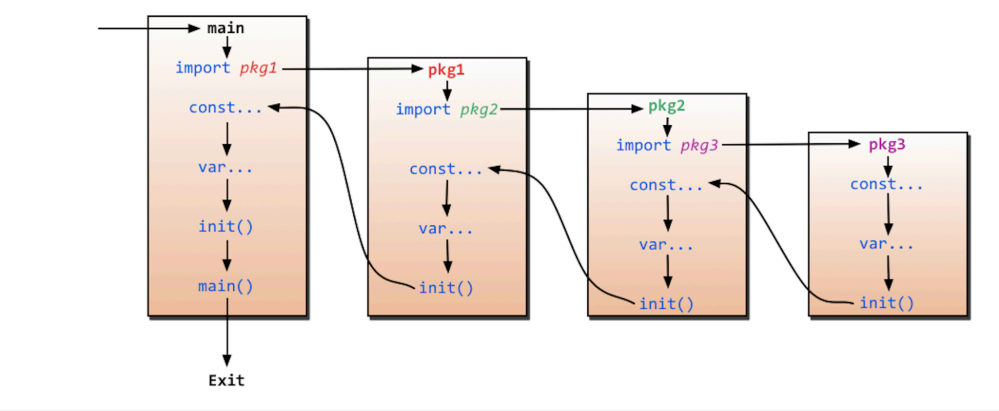
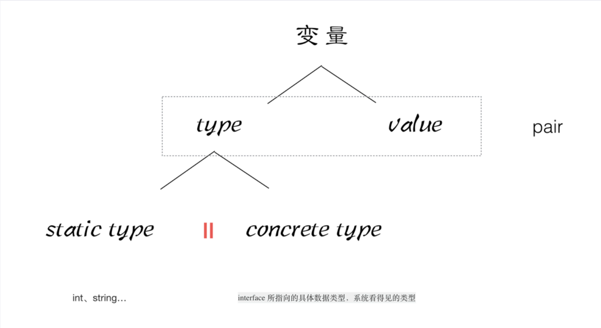

# 1 介绍

> 相关文档[6.6. 递归函数 | 第六章. 函数（function） |《Go 入门指南》| Go 技术论坛 (learnku.com)](https://learnku.com/docs/the-way-to-go/recursive-function/3604)

## 1.1 Go的特点

Go语言保证了既能到达静态编译语言的安全和性能，又达到了动态语言开发维护的高效率使用一个表达式来形容Go语言：**Go=C+Python**

1. **从c语言中继承**了很多理念，包括表达式语法，控制结构，基础数据类型，调用参数传值，指针等等，也保留了和c语言一样的编译执行方式及弱化的指针。
2. 引入包的概念，用于组织程序结构，Go语言的**一个文件都要归属于一个包**，而不能单独存在。
3. **垃圾回收机制**，内存自动回收，不需开发人员管理
4. **天然并发**
   - 语言层面支持并发，实现简单
   - goroutine，轻量级线程，可实现大并发处理，高效利用多核。
   - 基于CPS并发模型(Communicating Sequential Processes )实现

5. 吸收了管道通信机制，形成Go语言特有的管道channel，通过管道channel，可以实现不同的goroute之间的相互通信。
6. 函数返回多个值
7. 新的创新：比如切片slice、延时执行defer等

## 1.2 Go的强项

1、云计算基础设施领域代表项目：

>  docker、kubernetes、etcd、consul、cloudflare CDN、七牛云存储等。

2、基础后端软件代表项目：

>  tidb、influxdb、cockroachdb等。

3、微服务代表项目：

> go-kit、micro、monzo bank的typhon、bilibili等。

4、互联网基础设施代表项目：

> 以太坊、hyperledger等。

## 1.3 项目管理

**GOPATH**

- 这是Go最初的项目管理，环境配置好GOPATH目录即可，路径推荐$HOME/go(Go默认的)

- GOPATH目录是作为项目的编译产出目录和依赖目录

  - `$GOPATH/pkg` - 用来存放依赖的(比如gin)
  - `$GOPATH/bin` - 用来存放自己项目编译后的二进制文件的
  - `$GOPATH/src` - 用来放自己项目代码的，使用模块区分

- GOPATH项目代码放在$GOPATH/src目录下，没有依赖管理！容易出版本冲突的问题

**Go Vendor**

- 为了解决GOPATH没有依赖版本管理的问题，Go推出了Go Vendor
- 在项目根目录下放一个vendor文件夹，存放依赖的副本信息，解决依赖版本冲突的问题
- 项目无法在vendor找到对应的依赖就会去GOPATH中寻找
- 带来的新问题：项目A依赖 项目B和项目C，而后项目B和项目C依赖不同版本的依赖D，这时D的不同版本都会引进来，造成依赖冲突

**Go Module**

- 经过一系列的迭代，Go带来了Go Module用作项目管理，在Go1.11后被作为默认项目管理
- Go Module通过项目根路径中的`go.mod`文件管理依赖名与版本范围，通过`go.sum`文件记录项目实际使用的依赖和版本
- 注意：Go Module项目目录可以存在任意位置，不强制在`$GOPATH/src`下
- 使用：
  - `mkdir myproject` - 创建项目目录
  - `go mod init` 项目名 - 进入目录执行
  - `go get github.com/gin-gonic/gin@v1.6` - 下载依赖，自动下载到$GOPATH/pkg/mod，有依赖管理
- 注意：
      ○建议将环境变量GO111MODULE设置为auto，这样就会根据当前工作目录下是否有go.mod决定使用什么进行项目管理
      ○不同版本管理下，go的一系列执行命令都会产生变化

| 命令            | 作用                                          |
| --------------- | --------------------------------------------- |
| go mod download | 下载依赖包到本地 (默认为 GOPATH/pkg/mod 目录) |
| go mod edit     | 编辑 go.mod 文件                              |
| go mod graph    | 打印模块依赖图                                |
| go mod init     | 初始化当前文件夹，创建 go.mod 文件            |
| go mod tidy     | 增加缺少的包，删除无用的包                    |
| go mod vendor   | 将依赖复制到 vendor 目录下                    |
| go mod verify   | 校验依赖                                      |
| go mod why      | 解释为什么需要依赖                            |


## 1.4 常用命令

> - Go有一系列的命令帮助我们去编译、运行、测试等
> - `go mod init {projectName}` - 空文件夹下执行，创建一个Go Module项目，生成go.mod文件
> - `go build -o {binaryName}` -  编译生成(所有go文件以及静态文件)可执行文件，需要在main函数的目录下，建议将main函数的go文件放在项目根目录
> - `go run main.go` - 直接运行Go文件，不会生成可执行文件，这个文件里必须有main函数
> - `go install` - 将编译后的可执行文件存放到$GOPATH/bin下
> - `go get` - 从远程下载第三方依赖到$GOPATH目录下(不同项目管理位置不一样嗷)
> - `go bug` - 提交Bug给Go官方
> - `go test` - 单元测试，Go内置有单元测试
> - `gofmt xxx.go` - 格式化go代码(可配合管道符进行全部格式化)

## 1.5 注意事项

- main函数所在go文件的特点
  - 文件名必须为 `main.go`
  - 必须属于main包，即`package main`
  - 一个项目只允许有一个main文件，推荐将其放在**项目根目录**
- **package**必须出现在有效代码的第一行
- **import**必须写在**package**下面，依赖导入后必须使用
- `main() {` - {必须在同一行，不能够换行

```go
// main包表明其为可执行文件
package main

import "fmt"

// 默认入口函数-和C语言一致
func main() {
	fmt.Print("Hello World!")
}
```

## 1.6 安装与配置

下载：

[The Go Programming Language](https://go.dev/)

配置：

这里面需要配置四个环境变量-go会自动配置一个，所以需要修改一下，一般在用户

1、GOROOT（这个只需要有即可，不需要配置）

2、GOPATH（配置这个是为了配置go env中的gopath，go会自动读取环境变量中名字为GOPATH的内容为go env的gopath）

3、GOPATH\bin（配置这个和第一个一样）

4、GOROOT\bin


[golang环境详细安装、配置_golang安装-CSDN博客](https://blog.csdn.net/qq_44830881/article/details/123457805)


主要是第三个不要忘了

GOPATH如果是自己创建的新的最好先创建目录，1.3 项目管理这里面有GOPATH目录的子文件夹，这里需要注意的是，bin之所以加在环境目录是因为在使用go install的时候，系统会自动将下载之后的文件编译成功的exe执行文件放入bin中。


```shell
#开启mod模式（项目管理需要用到）
go env -w GO111MODULE=on
#重新设置成七牛镜像源（推荐）或阿里镜像源（用原有的会比较慢）
go env -w GOPROXY=https://goproxy.cn,direct
go env -w GOPROXY=https://mirrors.aliyun.com/goproxy

#关闭包的MD5校验
go env -w GOSUMDB=off

#查看环境变量
go env
```


运行文件

新建main.go

```go
package main
func main() {}
```


```go
go mod init 项目名字
```


```go
go mod tidy
```


```go
go run mian.go
```


## 1.7 Go与Java对比

| #                         | Java                                                         | golang                                                       |
| :------------------------ | :----------------------------------------------------------- | :----------------------------------------------------------- |
| 1. 标明公共资源           | public关键词                                                 | 首字母大写                                                   |
| 2. 标明程序最后执行的逻辑 | finally关键词                                                | defer关键词，比Java更灵活一点                                |
| 3. 接口实现逻辑           | implements关键词（侵入式）                                   | 非侵入式的（不需要通过任何关键词声明类型与接口之间的实现关系，只要一个类型实现了接口的所有方法，那么这个类型就是这个接口的实现类型） |
| 4. 异常处理               | Error 和 Exception分开的手动：throw捕获：catch               | 只有error（可以手动，也有可能是程序运行过程中产生）。手动：panic捕获：recover |
| 5. 继承                   | extends关键词，不支持多继承（一个类只能继承自一个类）        | 直接将父类作为成员放到了子类中，支持多继承                   |
| 6. 指针                   | Java不存在显示指针                                           | golang中用*代表显示指针。在Golang中，只有切片、指针、channel、map及func属于引用类型，其余的要向传递引用都得用&符号取地址 |
| 7. 并发                   | Java一般通过共享变量（信号量，阻塞队列）来保持线程间的通信   | 通过channel保持协程间通信，chan的读取和写入操作为原子操作，所以是线程安全的 |
| 8. 垃圾回收&&内存管理     | JVM(CMS, G1, ZGC)，标记复制制，清除，整理算法                | golang内存释放是语言层面，对不再使用的内存资源进行自动回收，使用非分代，并发的三色标记算法 |
| 9. 编译                   | Java需要先将代码打包编译成字节码，然后再由jvm虚拟机来解释执行 | golang不存在虚拟机，直接编译运行                             |
| 10. 性能                  | Java的用户线程和内核线程是一对应的，每开一个线程，都需要发起系统调用，从用户态切换到内核态的，这个过程是非常耗损性能的。 | 引入了协程，Java的用户线程和内核线程是一一对应的，但是我们的协程和内核线程他是M:N的一个关系，我们6个协程可能共用两个用户线程，那么具体哪个协程能够拿到内核线程去进行处理，这个会由我们的协程调度器来进行调度。所以可以说我们就是大大减少了这种用户态到内核态切换的一个损耗 |

# 2 语言基础

## 2.1 输入输出

- Go有多种输出方式，如下：
  - `fmt.Fprintln()` - 使用OS标准输出流，自带换行
    - 可以将内容直接写进文件 - `fmt.Fprintln({文件流}, "HelloWorld")`
  - `fmt.Fprintf()` - 使用转译输出，换行需自己处理
  - `fmt.Println()` - 简化`Fprint`
  - `fmt.Sprint()` - 类似字符串拼接函数
  - `log` - Go自带日志处理

- Go有多种输入方式，如下：
  - 使用`fmt`包下的`Scan()`、`Scanln()`、`Scanf()`等（区别是分隔符不同）

```go
func main() {
	file, err := os.Create("output.txt")
	if err != nil {
		log.Fatal(err)  // 日志处理
	}
	defer file.Close()

	// 将字符串 Hello, World!写入文件
	fmt.Fprintln(file, "Hello, World!")

	// 转译输出
	fmt.Printf("Hello \t World \n Hello")

	// 拼接返回一个字符串
	sentence := fmt.Sprint("你好,我今年", 20, "岁")
	fmt.Print(sentence)
}
```

> 输出demo

```go
func main() {
	var name string
	var age int

	// 输入 20,Aomsir
	fmt.Scanf("%d,%s", &age, &name)
	fmt.Printf("%s\t%d\n", name, age)
}
```

> 输入demo


## 2.2 定义变量

- Go命名规则：以字母或下划线开头，后面由数字，字母，下划线组成。

声明变量：

1. `var name string` - 可全局使用。
2. `name := "Aomsir"` - 只能在函数内使用，但用得最多。
3. `var name = "Aomsir"` - 与2等价，但是全局可用。

注意：

- Go语言中，`=`和`:=`都是用来赋值的，但使用上有差别。
- `=`用于给已有变量进行复制。
- `:=`是短变量声明，用于声明短变量并进行赋值。

```go
// 批量声明定义变量
var (
	age     int    = 12
	content string = "I'm content\n"
)

func main() {
	// 结构体类型
	student := [...]struct {
		name string
		age  int
	}{
		{"Aomsir", 20},
		{"Jewix", 24},
	}
	for index := 0; index < len(list); index++ {
		fmt.Println(list[index])
	}
	fmt.Println(student)
}
```


## 2.3 定义常量

- Go语言中，常量使用`const`关键字进行声明定义，不强制要求使用，值不能够被改变。

- Go中常量可以参与运算。

- 常量生成器(`iota`)如下所示：
  - 默认第一个为0，后面依次递增。

```go
package main

import "fmt"

func main() {
	// 常量生成器
	const (
		a = iota
		b
		c
	)

	// 0 1 2
	fmt.Println(a, b, c)
}
```


## 2.4 数据类型

- Golang提供有多种数据类型，如下：

- `bool`
  - 布尔类型，值为 `true/false`，默认为 `false`，无法参与运算。

- `int8/uint8`、`int16/uint16`、`int32/uint32`、`int64/uint64`、`int/uint`（默认，根据CPU决定位数）
  - 一般使用整型默认为 `int`。
  - `int8`代表8位有符号整数，以此类推，`uint`同理。
  - `uint`代表无符号整数。

- `float32`、`float64`
  - `float32`为单精度浮点型。
  - `float64`为双精度浮点型，用的更多。

- `string`
  - 字符串类型，较为灵活。

- `complex64`、`complex128`
  - 复数类型带有实部和虚部，通常用来计算。

- `array`
  - 同一类型固定长度数组，元素类型与元素长度在声明时已确定。

- `slice`
  - 切片类型，是一种动态数组类型，支持动态扩容，提供灵活的访问和修改元素的方式。
  - 切片类型（以 `int` 为例）定义的时候不需要指定元素个数，比如 `[]int`。
  - 定义可以使用 `make` 函数，如下，当前存储5个元素，初始值都为0，最多可扩容10个（如满系统会自动扩容）。

- `map`
  - 键值对类型，与切片一致，有两种方式进行定义。
  - 定义：
    - `var mapName map[keyType]valueType`
    - `make(map[keyType]valueType)`

- `chan`
  - 在Go中，管道类型是一种内存的通信方式，用于在不同的Goroutine之间传递数据。
  - 管道可以看作一个队列，设置size即为缓冲管道，否则为不缓冲管道。
  - 定义： `var channelName chan elementType`
  - 初始化： `make(chan elementType, size)`
  - 还有单向管道，双向管道，用到再查。

- `struct`
  - 结构体类型，定义与使用如下。
  - Go语言没有明确的面向对象特性，结构体可看为类。
  - 属性名首字母大写代表为public，小写为private，公开的话可以被其他包直接访问（例如：`person1.Name`），否则只能通过暴露的函数。

- `interface`
  - 接口类型，与Java类似，是一种抽象类型，定义一组方法的集合（没有实现）。
  - 这部分需要结合结构体与函数一起看。
  - `interface{}`，可以代表任何事务，类似于泛型，可以代表变量或函数。

- 注意：

  - Go当中变量的数据类型转换只有显示转换。
  - 数据类型转换：`类型(变量名或值)`。
  - Go语言没有字符类型，可以使用字符编码进行转换，如 `fmt.Printf("%c",i)`。
  - 空指针为 `nil`。
  - 查看占用字节数：`unsafe.Sizeof(var)`。
  - 不同数据类型的变量进行运算必须将类型转换成一样。


### 2.4.1 数组类型

```go
func main() {
	// 显示声明并赋值
	var studentLists1 [3]int = [3]int{1, 2, 3}

	// 直接声明
	studentLists2 := [3]int{1, 2, 3}

	// 不指定类型直接声明
	var studentLists3 = [3]int{1, 2, 3}

	// 不指定元素个数
	var studentLists4 = [...]int{1, 2, 3}

	// 后续遍历进行赋值
	var studentLists5 [...]int

    //正常遍历
    for i := 0; i < len(myArray1); i++ {
		fmt.Println(myArray1[i])	
	}
    
    // 带有index的遍历
	for index, value := range myArray2 {
		fmt.Println("index = ", index, ", value = ", value)
	}
}
```

> 1、数组的长度是固定的
>
> 2、在go中，**数组类型**在函数中的传递是值传递 **切片类型**是引用传递，一般来说表示数组使用**切片类型**

### 2.4.2 结构体类型（类）

```go
package main

import "fmt"

//声明一种行的数据类型 myint， 是int的一个别名
type myint int

//定义一个结构体
type Book struct {
	title string
	auth  string
}

func changeBook(book Book) {
	//传递一个book的副本
	book.auth = "666"
}

func changeBook2(book *Book) {
	//指针传递
	// 这里是go做了优化，所以可以不使用*book，不然就需要使用了 为后续类做铺垫
	book.auth = "777"
}

func main() {
	/*
		var a myint = 10
		fmt.Println("a = ", a)
		fmt.Printf("type of a = %T\n", a)
	*/

	var book1 Book
	book1.title = "Golang"
	book1.auth = "zhang3"

	changeBook(book1)


	changeBook2(&book1)

}
```

2.4.3 切片类型（动态数组）

```go
package main

import "fmt"

func printArray(myArray []int) {
	//引用传递
	// _ 表示匿名的变量
	for _, value := range myArray {
		fmt.Println("value = ", value)
	}

	myArray[0] = 100
}

func main() {
	myArray := []int{1,2,3,4} // 动态数组，切片 slice
	printArray(myArray)

	for _, value := range myArray {
		fmt.Println("value = ", value)
	}
}
```

> 这个是引用传递

```go
package main

import "fmt"

func main() {
	//声明slice1是一个切片，并且初始化，默认值是1，2，3。 长度len是3
	slice1 := []int{1, 2, 3}

	//声明slice1是一个切片，但是并没有给slice分配空间
	var slice1 []int
    
    
	slice1 = make([]int, 3) //开辟3个空间 ，默认值是0

	//声明slice1是一个切片，同时给slice分配空间，3个空间，初始化值是0
	var slice1 []int = make([]int, 3)

    
	//声明slice1是一个切片，同时给slice分配空间，3个空间，初始化值是0, 通过:=推导出slice是一个切片
	slice1 := make([]int, 3)

	//判断一个silce是否为0
	if slice1 == nil {
		fmt.Println("slice1 是一个空切片")
	} else {
		fmt.Println("slice1 是有空间的")
	}
}
```

> 使用make语句进行分配空间

```go
	var numbers = make([]int, 3, 5)

	fmt.Printf("len = %d, cap = %d, slice = %v\n", len(numbers), cap(numbers), numbers)

	//向numbers切片追加一个元素1, numbers len = 4， [0,0,0,1], cap = 5
	numbers = append(numbers, 1)

	//向numbers切片追加一个元素2, numbers len = 5， [0,0,0,1,2], cap = 5
	numbers = append(numbers, 2)

	fmt.Printf("len = %d, cap = %d, slice = %v\n", len(numbers), cap(numbers), numbers)

	//向一个容量cap已经满的slice 追加元素，会开辟一个原cap的容量，即2*cap=10
	numbers = append(numbers, 3)
```

> `append`扩容关键字 `len` 长度，`cap`容量

```go
func main() {
	s := []int{1, 2, 3} //len = 3, cap = 3, [1,2,3]

	//[0, 2)
	s1 := s[0:2] // [1, 2]

	fmt.Println(s1)

	s1[0] = 100

	fmt.Println(s)
	fmt.Println(s1)

	//copy 可以将底层数组的slice一起进行拷贝
	s2 := make([]int, 3) //s2 = [0,0,0]

	//将s中的值 依次拷贝到s2中
	copy(s2, s)
	fmt.Println(s2)

}
```

> 注意一下，如果进行copy，需要这样做，第一个打印s和s1都会被修改，底层是这样做的。

### 2.4.4 映射类型（map）

```go
package main

import "fmt"

func main() {
	//===> 第一种声明方式

	//声明myMap1是一种map类型 key是括号的string， value是string
	var myMap1 map[string]string
	if myMap1 == nil {
		fmt.Println("myMap1 是一个空map")
	}

	//在使用map前， 需要先用make给map分配数据空间
	myMap1 = make(map[string]string, 10)

	myMap1["one"] = "java"
	myMap1["two"] = "c++"
	myMap1["three"] = "python"

	fmt.Println(myMap1)

	//===> 第二种声明方式
	myMap2 := make(map[int]string)
	myMap2[1] = "java"
	myMap2[2] = "c++"
	myMap2[3] = "python"

	fmt.Println(myMap2)

	//===> 第三种声明方式
	myMap3 := map[string]string{
		"one":   "php",
		"two":   "c++",
		"three": "python",
	}
	fmt.Println(myMap3)
}

```

> 三种声明方式，如果不用make进行分配，将会为nil

```go
func printMap(cityMap map[string]string) {
	//cityMap 是一个引用传递
	for key, value := range cityMap {
		fmt.Println("key = ", key)
		fmt.Println("value = ", value)
	}
}

func ChangeValue(cityMap map[string]string) {
	cityMap["England"] = "London"
}

func main() {
	cityMap := make(map[string]string)

	//添加
	cityMap["China"] = "Beijing"
	cityMap["Japan"] = "Tokyo"
	cityMap["USA"] = "NewYork"

	//遍历
	printMap(cityMap)

	//删除
	delete(cityMap, "China")

	//修改
	cityMap["USA"] = "DC"
	ChangeValue(cityMap)

	fmt.Println("-------")

	//遍历
	printMap(cityMap)
}

```

> map 的增删改查
>
> 引用传递

### 2.4.5 管道类型

> 底层是队列，分有缓存和无缓存，无缓存阻塞情况严重

```go
package main

import "fmt"

func main() {
	//定义一个无缓存channel
	c := make(chan int)

    //定义一个有缓存channel 容量为3
	c := make(chan int, 3)

    
	go func() {
		defer fmt.Println("goroutine结束")

		fmt.Println("goroutine 正在运行...")

		c <- 666 //将666 发送给c
	}()

	num := <-c //从c中接受数据，并赋值给num 此时会发生阻塞

	fmt.Println("num = ", num)
	fmt.Println("main goroutine 结束...")
}

```

```go
func main() {
	c := make(chan int)

	go func() {
		for i := 0; i < 5; i++ {
			c <- i
			//close可以关闭一个channel
			close(c)
		}
	}()

	for {
		//ok如果为true表示channel没有关闭，如果为false表示channel已经关闭
		if data, ok := <-c; ok {
			fmt.Println(data)
		} else {
			break
		}
	}
    
    //可以使用range来迭代不断操作channel
	for data := range c {
		fmt.Println(data)
	}

}
```

```go
select {
	case <-chan1:
		//如果chan1成功读到数据，则进行该case处理语句
	case chan2<- 1:
		//如果成功向chan2写入数据，则进行该case处理语句
	default:
		//如果上面都没有成功，则进入default处理流程
}
```

> 1、这个是通过`<-`符号进行**管道**使用   存值和取值，18行和21行
>
> 2、使用`close(T)`来关闭**管道**
>
> 3、使用**range**来遍历操作**channel**
>
> 4、使用**select**来进行操作多条件
>
> - channel不像文件一样需要经常去关闭，只有当你确实没有任何发送数据了，或者你想显式的结束range循环之类的，才去关闭channel;
>
> - 关闭channel后，无法向channel再发送数据（引l发panic错误后导致接收立即返回零值）；
>
> - 关闭channel后，可以继续从channel接收数据；
>
> - 对于nilchannel，无论收发都会被阻塞。

### 2.4.6 接口类型

> 看[4.3多态](# 4.3 多态)就行了


### 2.4.7 引用类型和值类型

**值类型（Value Types）**
值类型包括基本类型如整数（int、float）、布尔值（bool）、字符串（string）以及数组（array）和结构体（struct）等。当值类型作为参数传递给函数时，会复制一份该值的副本给函数，函数内部对这个副本的修改不会影响到原始数据。这是典型的值传递行为。
**引用类型（Reference Types）**
引用类型包括切片（slice）、映射（map）、通道（channel）、接口（interface）、函数（function）和指针（pointer）。当引用类型作为参数传递时，传递的是该类型的引用（即内存地址）的一个副本。这意味着，尽管传递的是引用的副本，但是这个副本仍然指向原始的数据。因此，在函数内部修改引用类型参数所指向的数据，会影响到原始数据。这种行为有时会被误解为“引用传递”，但实际上还是值传递，只是传递的值是引用的地址。


#  3 语言进阶

## 3.1 函数

### 3.1.1 基本使用


### 3.1.2 多返回值

- Go提供多返回值函数，定义方式如下：
- 调用多返回值的函数时，如不想接收某个返回值，可采用 `_` 进行占位。

```go
package main

import "fmt"

//返回多个返回值， 有形参名称的
func foo3(a string, b int) (r1 int, r2 int) {
	fmt.Println("---- foo3 ----")
	fmt.Println("a = ", a)
	fmt.Println("b = ", b)


	//r1 r2 属于foo3的形参，  初始化默认的值是0
	//r1 r2 作用域空间 是foo3 整个函数体的{}空间
	fmt.Println("r1 = ", r1)
	fmt.Println("r2 = ", r2)


	//给有名称的返回值变量赋值
	r1 = 1000
	r2 = 2000

	return
}

func show() (string, int, string) {
	fmt.Println("执行了show()")
	return "Aomsir", 20, "info@say521.cn"
}

func main() {
    // 函数调用
	name, age, _ := show()
	ret1, ret2 = foo3("foo3", 333)

	fmt.Println(name, age)
	fmt.Println("ret1 = ", ret1, " ret2 = ", ret2)
}
```

> 对于第六行，因为返回值中两个参数都是int，可以只写后面一个，形参中也同理，假设都是int
>
> `func foo3(a, b int) (r1, r2 int) {`


### 3.1.3 import导包与init函数



```go
package main

import (
	_ "GolangStudy/5-init/lib1"
	mylib2 "GolangStudy/5-init/lib2"
	//. "GolangStudy/5-init/lib2"
)

func main() {
	//lib1.lib1Test()

	//lib2.Lib2Test()
	mylib2.Lib2Test()
	//Lib2Test()
}

```


> 1、需要注意，导包需要首字母大写
>
> 2、可以使用`_`关键字仅导入而不使用
>
> 3、可以使用`.`关键字直接使用导入包中函数，而不使用`包.函数`形式
>
> 4、前面加字符串是起别名
>
> 5、在package上面的以 _（下划线）开头的包名暗示这个包的主要目的不是为了被直接导入和使用，而是为了导出一些常量、变量或函数供其他包（通过导入语句）来初始化或使用。


**init函数：**

> init函数的主要特点和用途包括：
>
> - 自动执行：无需显式调用，当包被导入时，其所有的init函数会自动执行。
> - 初始化顺序：在程序启动时，Go会按照依赖关系顺序调用所有包中的init函数。首先调用依赖包的init，然后是当前包的init，这保证了如果包A依赖于包B，B的init会在A的init之前执行。
> - 常用于：设置默认配置、注册全局变量、打开数据库连接、验证环境变量、初始化日志系统等一次性且在整个程序生命周期中只需要执行一次的操作。
> - 不可见性：init函数对包外是不可见的，不能被外部代码直接调用。

入在导入数据库的时候

```go
package models
import (
  "gorm.io/driver/mysql"
  "gorm.io/gorm"
)

var DB *gorm.DB
var err error

func init() {
  // 参考 https://github.com/go-sql-driver/mysql#dsn-data-source-name 获取详情
  dsn := "user:pass@tcp(127.0.0.1:3306)/dbname?charset=utf8mb4&parseTime=True&loc=Local"
  DB, err = gorm.Open(mysql.Open(dsn), &gorm.Config{})
  if err != nil {
	fmt.Println(err)
  }
}
```

> 这样就直接自动连接数据库了，使用`var DB *gorm.DB`是为了让db导出


### 3.1.4 defer延迟函数

- Go语言提供延迟函数，用于将一个函数的执行推迟到当前函数返回之前。
- 延迟函数通常用于释放资源、清理状态等操作。
- 延迟函数通过 `defer` 关键字操作。
- 延迟函数的执行是按书写顺序的逆序执行的（FIFO）。
- 注意：不要将它们嵌套或者递归，会影响程序的性能。

```go
package main

import "fmt"

func test() String {
	defer fmt.Println("defer test")

	return "return test"
}

func main() {
	//写入defer关键字
	defer fmt.Println("main end1")
	defer fmt.Println("main end2")


	fmt.Println("main::hello go 1")
	fmt.Println("main::hello go 2")
}
```

> defer就是一个栈，先进后出，所以对于main函数中先打印main end2，在打印main end1， test函数中先打印defer test，后打印return test。类似c++虚构函数。


### 3.1.5 匿名函数

```go
func add(x, y int) int {
	return x + y
}

func main() {
	// 定义一个名为 f 的函数变量，并将 add 函数赋值给它
	var f func(int, int) int = add

	// 使用函数变量来调用函数
	result := f(1, 2)
	fmt.Println(result) // 输出：3


    // 定义一个名为 f 的函数变量，并将一个匿名函数赋值给它
    f1 := func(x, y int) int {
        return x + y
    }
    // 定义一个直接执行的匿名函数
    func(a ,b int) {
        fmt.Println("匿名函数")
    }(10, 20)
    
    // 使用函数变量来调用函数
    result1 := f1(1, 2)
    fmt.Println(result) // 输出：3
}
```

> 19-21行，第一个括号是参数的意思，第二个括号是对匿名函数的调用


### 3.1.6 函数的声明周期

```go
package _chan

import (
	"fmt"
	"testing"
	"time"
)

// stop goroutine 退出函数。
func stop(stopCh chan struct{}, fn func()) {
	for {
		select {
		// stopCh，close掉了，然后读到值
		case <-stopCh:
			return
		case <-time.After(1 * time.Second):
			fmt.Println("begin running fn()")
			fn()
		}
	}
}

func Test_Stop(t *testing.T) {
	stopCh := make(chan struct{})

	fn := func() {
		fmt.Println("fn run")
	}

	// 模拟3s之后停止
	go func(stopCh chan struct{}) {
		select {
		case <-time.After(3 * time.Second):
			close(stopCh)
			fmt.Println("stopCh closed")
		}
	}(stopCh)

	stop(stopCh, fn)
}

```

question:

我这里面有几个问题，1、stopCh是在Test_Stop定义的，所以说当主函数调用stop的时候就将一个固定的值传了过去了吧？所以说stop不应该接受一个固定的stopCh吗？为什么还可以一直监听stopCh，这个测试类当进行到 stop(stopCh, fn)这个函数的时候应该是已经被回收了把，然后里面的协程是等三秒运行完毕的

answer：

您的疑问集中在 stopCh 通道的生命周期、如何在 stop 函数中持续监听它，以及 Test_Stop 函数的执行流程上。让我们逐一解析：

1. **stopCh 的生命周期与传递**：stopCh 在 Test_Stop 函数中定义，然后作为参数传递给了 stop 函数。这里传递的并不是一个固定的值，而是通道的引用（或者说地址）。在 Go 语言中，通道是一种引用类型，当作为参数传递时，传递的是该通道的引用，而不是通道内容的拷贝。因此，stop 函数能够直接访问和操作原始的 stopCh 通道，包括监听其上的变化。

2. **持续监听 stopCh**：尽管 stop(stopCh, fn) 这一行代码很快执行完毕，但是 stop 函数内部启动了一个无限循环，这个循环不断地使用 select 监听 stopCh 和超时事件。只要 stop 函数没有返回（即没有从 stopCh 收到信号或程序没有主动终止），这个监听就会持续进行。因此，即使调用 stop 的那一刻过去了，stop 函数内的循环还在后台运行，持续监听 stopCh。

3. **Test_Stop 函数的执行与回收**：当执行到 stop(stopCh, fn) 这一行时，Test_Stop 函数并没有立即结束或被回收。Go 语言的运行时会保持 Test_Stop 函数的活跃状态，因为它启动了至少两个 goroutine：一个是直接调用的 stop 函数所在的 goroutine，另一个是在 Test_Stop 内部启动的匿名 goroutine（用于3秒后关闭 stopCh）。这两个 goroutine 都在执行中，因此 Test_Stop 的执行上下文（包括局部变量如 stopCh）会保持有效，直到所有相关 goroutine 都完成。

   总结来说，stop(stopCh, fn) 的调用启动了一个持续监听 stopCh 的过程，而这个过程不会因为 Test_Stop 函数到达这一行而结束，因为 goroutine 的执行是独立的。stopCh 作为引用传递，使得 stop 函数可以持续影响和响应其状态变化，即使在调用点之后。

### 3.1.7 函数集合

```go
// Op 定义对 msg 处理的函数集合。
type Op func(any) (any, error)

// decode 解码远程消息。
func decode(msg any) Op {
    return func(any) (any, error) {
        // decode msg
        fmt.Println("decoding ... ", msg)
        decodedRes := fmt.Sprintf("decoded_%v", msg)
        fmt.Println("decoded to parameter -> ", decodedRes)
        return decodedRes, nil
    }
}

// opAction 模拟服务提供方处理业务逻辑。
func opAction(parameter any) Op {
    return func(any) (any, error) {
        // decode msg
        fmt.Println("do opAction ... ", parameter)
        opRes := fmt.Sprintf("opAction_%v", parameter)
        fmt.Println("after opAction result -> ", opRes)
        return opRes, nil
    }
}
```

> 定义一个op，然后再函数的返回值上调用


## 3.2 指针

> 和c++指针一样


## 3.3 tag序列化

- Go中，结构体属性可以通过序列化的方式转换为一系列字节流或者JSON字符串。

- 注意：
  - 结构体属性值必须是公有（不使用tag标签的情况）。
  - 使用**tag**标签的情况下不需要，可以保证属性的私密性。
  - 结构体属性类型必须是JSON支持的数据类型之一。

```go
type Student struct {
	name string `json:"name"`
	age  int    `json:"age"`
}
```

> 这里`json`是键，`name`是值，命名非固定，为`key value`结构
>
> 这里可以通过反射进行取出相应的tag标签的值

实例如下：

```go
package main

import (
	"encoding/json"
	"fmt"
)

type Movie struct {
	Title  string   `json:"title"`
	Year   int      `json:"year"`
	Price  int      `json:"rmb"`
	Actors []string `json:"actors"`
}

func main() {
	movie := Movie{"喜剧之王", 2000, 10, []string{"xingye", "zhangbozhi"}}

	//编码的过程  结构体---> json
	jsonStr, err := json.Marshal(movie)
	if err != nil {
		fmt.Println("json marshal error", err)
		return
	}

	fmt.Printf("jsonStr = %s\n", jsonStr)

	//解码的过程 jsonstr ---> 结构体
	//jsonStr = {"title":"喜剧之王","year":2000,"rmb":10,"actors":["xingye","zhangbozhi"]}
	myMovie := Movie{}
	err = json.Unmarshal(jsonStr, &myMovie)
	if err != nil {
		fmt.Println("json unmarshal error ", err)
		return
	}

	fmt.Printf("%v\n", myMovie)
}
```


## 3.4 泛型

> 泛型函数，泛型切片，泛型map，

```go
package main

import "fmt"

// 泛型函数
func PrintSliceTypeSlice[T int | int64 | string](slice []T) {
  fmt.Printf("%T\n", slice)
  for _, v := range slice {
    fmt.Printf("%T  %v\n", v, v)
  }
}

func main() {

  PrintSliceTypeSlice([]int{1, 2, 3, 4, 5})
  PrintSliceTypeSlice([]int64{1, 2, 3, 4, 5})
  PrintSliceTypeSlice([]string{"hello"})
  
  // 标准写法
  PrintSliceTypeSlice[int]([]int{1, 2, 3, 4, 5})
  PrintSliceTypeSlice[int64]([]int64{1, 2, 3, 4, 5})
  PrintSliceTypeSlice[string]([]string{"hello"})

}

```


## 3.5 测似类 testing

在 Go 中，

1、测试文件必须以 `_test.go` 结尾，

2、测试函数需要以大写的`Test`进行开头，并且使用`(t *testing.T)`作为形参

3、使用命令`go test`进行运行测试类

4、断言函数testing.T提供的Error Errorf Fail FailNow

chan_test.go

```go
func Test_Stop(t *testing.T) {
	stopCh := make(chan struct{})

	fn := func() {
		fmt.Println("fn run")
	}

	// 模拟3s之后停止
	go func(stopCh chan struct{}) {
		select {
		case <-time.After(3 * time.Second):
			close(stopCh)
			fmt.Println("stopCh closed")
		}
	}(stopCh)

	stop(stopCh, fn)
}
```


# 4 面向对象

> go中的类是通过结构体来构建

## 4.1 封装

> - Go通过属性与方法大小写控制访问权限
> - 属性名/方法名首字母大写代表Public，别的包则可以访问，否则无法直接访问

```go
package main

import "fmt"

//如果类名首字母大写，表示其他包也能够访问
type Hero struct {
	//如果说类的属性首字母大写, 表示该属性是对外能够访问的，否则的话只能够类的内部访问
	Name  string
	Ad    int
	level int
}

/*
func (this Hero) SetName(newName string) {
	//this 是调用该方法的对象的一个副本（拷贝）
	this.Name = newName
}
*/
func (this *Hero) Show() {
	fmt.Println("Name = ", this.Name)
	fmt.Println("Ad = ", this.Ad)
	fmt.Println("Level = ", this.level)
}

func (this *Hero) GetName() string {
	return this.Name
}

func (this *Hero) SetName(newName string) {
	this.Name = newName
}

func main() {
	//创建一个对象
	hero := Hero{Name: "zhang3", Ad: 100}
	hero.Show()
	hero.SetName("li4")
	hero.Show()
}

```

> 1、go中没有类，只有结构体，可以自己整个类
>
> 2、this这个不是java和c++中的this，go中没有this，这个就是个形参名，改什么都行
>
> 3、当**变量名**和**函数名**的**首字母大写**的时候表示其他包也能够访问
>
> 4、类的属性**首字母大写**, 表示该属性是对外能够访问的，否则的话只能够类的内部访问
>
> 5、当写get和set的时候，我们应该使用指针。因为结构体是**拷贝**
>
> 6、 如何创建一个对象

## 4.2 继承

> - 匿名属性如下，不能够出现两个同类型的匿名属性
> - Go的继承可以通过两种方式实现
>   - 嵌入结构体
>   - 组合类型
>   - 使用接口 - 放下一小章节


- 嵌入结构体（继承本质）

```go
type Human struct {
	name string
	sex  string
}

func (this *Human) Eat() {
	fmt.Println("Human.Eat()...")
}

type SuperMan struct {
	Human //SuperMan类继承了Human类的方法  嵌入结构体
	level int
}

//重定义父类的方法Eat()
func (this *SuperMan) Eat() {
	fmt.Println("SuperMan.Eat()...")
}
```

> 继承
>
> 子类直接在结构体中直接添加父类（父结构体）名称

- 匿名属性

```go
type People struct {
	string // 匿名属性
	int
}

func main() {
	people := People{"Aomsir", 20}
	fmt.Println(people.string) // 调用属性类型
	fmt.Println(people.int)
}
```

- 组合类型

```go
type People struct {
	name string
	age  int
}

type Teacher struct {
	classroom string
	people    People   // 组合
}

func main() {
	teacher := Teacher{"2006", People{"Aomsir", 20}}
	fmt.Println(teacher)
	fmt.Println(teacher.people.name, teacher.people)
}
```


## 4.3 多态

> go中的多态是通过`interface`关键字来集成的

```go
package main

import "fmt"

//本质是一个指针
type AnimalIF interface {
	Sleep()
	GetColor() string //获取动物的颜色
	GetType() string  //获取动物的种类
}

//具体的类
type Cat struct {
	color string //猫的颜色
}

func (this *Cat) Sleep() {
	fmt.Println("Cat is Sleep")
}

func (this *Cat) GetColor() string {
	return this.color
}

func (this *Cat) GetType() string {
	return "Cat"
}

//具体的类
type Dog struct {
	color string
}

func (this *Dog) Sleep() {
	fmt.Println("Dog is Sleep")
}

func (this *Dog) GetColor() string {
	return this.color
}

func (this *Dog) GetType() string {
	return "Dog"
}

func showAnimal(animal AnimalIF) {
	animal.Sleep() //多态 这里是向下转型 和c++类似
	fmt.Println("color = ", animal.GetColor())
	fmt.Println("kind = ", animal.GetType())
}

func main() {

	var animal AnimalIF //接口的数据类型， 父类指针
	animal = &Cat{"Green"} // 这里使用&是因为父对象指向子类地址

	animal.Sleep() //调用的就是Cat的Sleep()方法 , 多态的现象

	animal = &Dog{"Yellow"}

	animal.Sleep() // 调用Dog的Sleep方法，多态的现象

	cat := Cat{"Green"}
	dog := Dog{"Yellow"}

	showAnimal(&cat)
	showAnimal(&dog)
}

```

> 多态
>
> 1、父类使用interface关键字
>
> 2、当子类实现父类的接口时候，我们应该使用`&`来进行定义，例`	animal = &Cat{"Green"} // 这里使用&是因为父对象指向子类地址`
>
> 好像也可以不传地址。


## 4.4 断言（pair）

> - Go当中，断言是一种非常重要的类型转换手段。类似**泛型**
> - 断言允许我们在运行的过程中将一个接口类型变量转换为其底层的具体操作。
> - 语法形式为 `x.(T)`。

```go
func main() {
	demo(456)   // 参数是int类型
	demo(456.9) // 参数是float类型
	demo(true)  // 参数类型不确定
}


// 参数为一个空接口类型变量
func demo(i interface{}) {
    // 断言语法将i转换为int类型，第一个返回值是值，第二个代表是否是整型
	_, response := i.(int)  
	if response == true {
		fmt.Println("参数是int类型")
		return
	}

	_, response = i.(float64)
	if response == true {
		fmt.Println("参数是float类型")
		return
	}

	fmt.Println("参数类型不确定")
	return
}
```

- pair

> 详细的看5.1反射机制

```go
package main

import "fmt"

type Reader interface {
	ReadBook()
}

type Writer interface {
	WriteBook()
}

//具体类型
type Book struct {
}

func (this *Book) ReadBook() {
	fmt.Println("Read a Book")
}

func (this *Book) WriteBook() {
	fmt.Println("Write a Book")
}

func main() {
	//b: pair<type:Book, value:book{}地址>
	b := &Book{}

	//r: pair<type:, value:>
	var r Reader
	//r: pair<type:Book, value:book{}地址>
	r = b

	r.ReadBook()

	var w Writer
	//r: pair<type:Book, value:book{}地址>
	w = r.(Writer) //此处的断言为什么会成功？ 因为w r 具体的type是一致

	w.WriteBook()
}

```

> `pair<type: , value: >`   `type`表示类型，`value`表示地址。这里面想突出的是`interface{}`断言的原理是这样，判断变量的pair中的type类型是否一样。


# 5 高级应用

## 5.1 反射机制

变量结构：



- Go语言提供反射机制，方便在运行的过程中可以动态地获取信息。

- Go语言的反射机制主要由 `reflect` 提供支持，常用函数如下：

  - `TypeOf(v interface{}) Type` - 获取一个变量的类型对象。
  - `ValueOf(v interface{}) Value` - 获取一个变量的值对象。
  - `NumField() int` - 获取一个结构体类型的字段数量。
  - `Field(i int) Value` - 获取结构体类型的第i个字段的值对象。
  - `Kind() Kind` - 获取一个值对象的类型分类。

- 使用如下：

```go
type People struct {
	Name    string
	Address string
}

func main() {
	a := 1.5

    // float64，反射获取变量的类型
	fmt.Println(reflect.TypeOf(a))

    // 1.5，反射获取变量的值
	fmt.Println(reflect.ValueOf(a))

	// 获取值
	people := People{"Aomsir", "Wuhan"}
	fmt.Println(reflect.TypeOf(people))                        // main.people
	fmt.Println(reflect.ValueOf(people))                       // {Aomsir Wuhan}
	fmt.Println(reflect.TypeOf(people).NumField())             // 属性个数
	fmt.Println(reflect.TypeOf(people).FieldByIndex([]int{1})) //{address main string  16 [1] false}


    // 修改值案例
    peo := new(People)
	peo.Name = "Aomsir"

	// 反射获取peo对象中的值(peo是指针对象,所以需要调用Elem()方法)
	v := reflect.ValueOf(peo).Elem()
	fmt.Println(v) // {Aomsir}

	// 使用反射修改peo结构体(属性名必须是可访问的)
	content := "Name"
	ok := v.FieldByName(content).CanSet()
	if ok {
		v.FieldByName(content).SetString("Jewix")
		fmt.Println(*peo) //  {Jewix}
	}

}
```


## 5.2 goroutine（协程）多线程

原理：

- 同步和通信是基于channel进行数据的同步和操作，协调多个goroutine是context，如协程的终止，发送信号。

- 是通过用户态线程进行调度和管理，线程是根据操作系统的内核态。

  > 像java中的thread，是用户态，创建的时候也需要内核态，他的系统调用、等待I/O操作、需要进行上下文切换或访问某些受保护资源是内核态的线程，也就是需要从用户态代码转到内核态，此时消耗很大。当协程代码触发了系统调用或I/O操作，虽然这些操作最终需要在内核态完成，但实际上是由支撑协程运行的基础线程（在Go中，每个goroutine最终由一个或几个操作系统线程支撑）来执行这些操作。上下文切换和访问受保护资源都是在用户态执行的，所以说这也是为什么协程性能高和轻量。

- 基于栈的动态增长，（每个goroutine初始大小只有几KB，需要更多的时候会动态增长）

- 上下文切换是通过多个goroutine协作进行的。

- 调动器 scheduler

- 垃圾回收器 gc，go可以回尽量不会影响，java的gc会阻塞用户线程

**并发调度器 scheduler：**

负责管理和调度goroutine的组件，并发执行。

使用了工作窃取：让空闲的线程去繁忙的线程中去拿任务

java的调度器：

> 操作系统有自己的工作队列，但是调度器存在一个全局的工作队列存放，这里面别搞混，os的thread有自己的工作队列。调度器维护的是全局的工作队列。当os完成了自己的工作队列就会尝试去调度器的全局队列进行窃取任务，从而实现负载均衡和更高的并发性能。

go的调度器：

> go语言的调度器会将goroutine和操作系统的线程绑定在一起形成一个G-M模型。G指goroutine，M指操作系统的线程，调度器会根据当前可用的这个操作系统的线程的数量和负载的情况来决定是否创建新的M，即创建新的goroutine绑定在M上。来实现类似java的调度器的模式，java调度器的模式go也有。

抢占式调度：

> 任何的goroutine在任意时刻都可能被调度器进行中断，这样可以防止goroutine长时间占用资源而导致其他的gorouine无法执行


> 这个关键字可以写成并发的格式
>
> 关键字`go`表示创建一个进程，`runtime.Goexit()`表示退出进程

```go
package main

import (
	"fmt"
	"time"
)

func main() {


		//用go创建承载一个形参为空，返回值为空的一个函数
		go func() {
			defer fmt.Println("A.defer")

			func() {
				defer fmt.Println("B.defer")
				//退出当前goroutine
				runtime.Goexit()
				fmt.Println("B")
			}()

			fmt.Println("A")
		}()

	go func(a int, b int) bool {
		fmt.Println("a = ", a, ", b = ", b)
		return true
	}(10, 20)

	//死循环
	for {
		time.Sleep(1 * time.Second)
	}

}

```

## 5.3 多线程

### 5.3.1 线程安全（Mutex&WaitGroup）

> WaitGroup 是 Go 内置的 sync 包解决任务编排的并发原语。WaitGroup 直译是“等待组”，翻译成大白话就是等待一组协程完成任务。如果没有完成，就阻塞。
>
> 其中atomic包中有一些原子性操作的一些东西。

```go
package main

import (
    "fmt"
    "math"
    "sync"
)

// 计算1000个数的和
func compute(m *sync.Mutex, wg *sync.WaitGroup, s, e int, count *int) {
    sum := 0
    for i := s; i < e; i++ {
        sum += i
    }
    m.Lock()
    *count += sum
    m.Unlock()
    wg.Done()
}

func main() {

    var m sync.Mutex
    var wg sync.WaitGroup

    var count int
    wg.Add(1000)
    for i := 0; i < 1000; i++ {
        go compute(&m, &wg, i*1000+1, (i+1)*1000+1, &count)
    }
    wg.Wait()
    fmt.Println(math.Sqrt(float64(count)))
    return
}
```

> 计算100万个数之和再开根号


### 5.3.2 sync

1. **Mutex（互斥锁）**:
   用于保护共享资源，确保同一时间只有一个goroutine可以访问资源。当一个goroutine获得了锁，其他尝试获取该锁的goroutine将会阻塞，直到锁被释放。
2. **RWMutex（读写锁）**:
   提供了读取者和写入者的区分对待。允许多个goroutine同时读取共享资源（读锁），但写入时会独占资源（写锁），阻止所有读取和写入操作。
3. **Cond（条件变量**）:
   用于实现goroutine之间的条件等待与通知机制。配合Mutex使用，可以让一个或多个goroutine等待某个条件满足时再继续执行。
4. **Once**:
   保证某个初始化函数（或其他操作）只执行一次，即使面对多goroutine并发请求也是如此。常用于单例模式的实现。
5. **WaitGroup**:
   用来等待一组goroutine完成。可以增加计数值来表示要等待的goroutine数量，每个goroutine完成时调用Done()减少计数，其他goroutine可以通过调用Wait()来阻塞直到计数归零，即所有goroutine执行完毕。


## 5.4 异常处理

- Go提供了对异常和错误的处理。

- 错误处理：
  - 错误返回值error 

  - 自定义 nil
  
  - 错误传递传递给上层
  
  - 错误日志记录log包
  
  - 错误处理函数
  
  - 错误类型断言
  
  - 错误包装 errors.Wrap
  
  - 错误码和错误类型
  
    
  
- 异常处理：
  - 异常抛出：`panic("异常信息")`，遇到就会终止后续代码执行（之前的defer还是会执行）。
  - 程序恢复：使用`recover`函数，通常与`defer`一起使用，可以接收panic的消息。
    - 如果程序抛出panic，有defer与recover的话，后续代码可以继续执行。
  
  > panic能不用就不用
  >
  > recover只会影响当前goroutine
  >
  > 不要期望一个goroutine中的panic可以被其他的goroutine捕获和处理。

> 向上抛
>
> 中断程序（panic）
>
> 恢复程序（recover）

- 向上抛

```go
package main

import (
	"errors"
	"fmt"
)


func demo(i, k int) (r int, e error) {
	if k == 0 {
		e = errors.New("除数不能为0")
		return
	} else {
		r = i / k
		return
	}
}

func main() {
	result, error := demo(6, 2)
	fmt.Println(result, error) // 3 <nil>

	result, error = demo(6, 0)
	fmt.Println(result, error) // 0 除数不能为0
}

```

> 将error直接抛出即可

- 中断程序（panic）

```go
// 执行结果: 111111111->遇到panic->defer的执行
func main() {
	defer fmt.Println("defer的执行")
	fmt.Println("1111111111")
	panic("遇到panic")
	fmt.Println("2222222222")
}
```

- 恢复程序（recover）

```go
func main() {
	fmt.Println("main程序开始")
	demo1()
	fmt.Println("main程序结束")
}

func demo1() {
	fmt.Println("demo1上半部分")
	demo2()
	fmt.Println("demo1下半部分")
}

func demo2() {
	defer func() {
		recover()
	}()
	fmt.Println("demo2上半部分")
	demo3()
	fmt.Println("demo2下半部分")
}

func demo3() {

	fmt.Println("demo3上半部分")
	panic("demo3中出现panic")
	fmt.Println("demo3下半部分")
}

// main程序开始
// demo1上半部分
// demo2上半部分
// demo3上半部分
// demo1下半部分
// main程序结束
```


## 5.5 IO流

### 5.5.1 文件夹与文件

- 使用os库进行创建文件夹

```go
func main() {

    // 要求创建的文件夹不存在,但是父目录必须存在
	error := os.Mkdir("文件夹目录", os.ModeDir)

    // 没有什么限制,父目录没有就帮忙创建
	error = os.MkdirAll("文件夹目录", os.ModeDir) 
	if error != nil {
		fmt.Println("文件夹创建失败", error)
		return
	} else {
		fmt.Println("文件夹创建成功")
	}

	// 创建文件
	file, error := os.Create("demo.go")
	if error != nil {
		fmt.Println("文件创建失败", error)
		return
	} else {
		fmt.Println(file.Name(), "文件创建成功")
	}

	// 重命名文件夹
	os.Rename("oldpath", "newpath")

	// 获取文件信息
	file, error = os.Open("demo.go")
	if error != nil {
		fmt.Println("文件获取失败", error)
		return
	}
	fileInfo, error := file.Stat() // 获取文件状态
	if error != nil {
		fmt.Println("文件信息获取失败", error)
		return
	} else {
		fmt.Println(fileInfo.Size())
	}

	// 删除文件夹/文件 - Remove/RemoveAll - 规则和上面的一致
	error = os.Remove("demo.go")
	if error != nil {
		fmt.Println("删除失败", error)
		return
	} else {
		fmt.Println("删除成功")
	}
}
```

### 5.5.2 输入流

```go
package main

import (
	"fmt"
	"os"
)

func main() {
	file, _ := os.Open("main.go") // 读取文件
	fileInfo, _ := file.Stat()    // 获取文件的信息

	buffer := make([]byte, fileInfo.Size()) // 创建buffer缓冲区

	file.Read(buffer) // 将文件里面的内容读取到buffer里面
	fmt.Println("文件中的内容为:", string(buffer))
}
```


### 5.5.3 输出流

```go
	if error != nil {
		file, _ = os.Create(filePath)
	}
	file.Write([]byte("package srfffffc"))
	file.WriteString("Hello\n\thhhhh")
}
```


### 5.5.4 ioutil工具类

> - ioutil是Go提供的一个工具包，方便我们对IO进行操作
> - 使用如下，还有更多拓展使用

```go
func main() {
    // 下面两种方式等价
    // 作用：获取文件输入流，将文件中的所有内容读到缓冲区
	file, _ := os.Open("go.txt")
	buffer, _ := ioutil.ReadAll(file)
	fmt.Println(string(buffer))

	buffer, _ = ioutil.ReadFile("go.txt")
	fmt.Println(string(buffer))
}
```


## 5.6 日志处理

- Go原生提供对日志的支持，不需要三方依赖，三种级别如下
  - Print()- 输出日志信息
  - Panic()- 打印日志信息，并触发panic
  - Fatal()- 打印日志信息后调用os.Exit(0)

```go
func main() {
	// log.Println("打印日志信息")
	// log.Panicln("打印fatal信息")
	// log.Fatalln("error")

	logFilePath := "golog.log"
	file, _ := os.OpenFile(logFilePath, os.O_APPEND|os.O_CREATE|os.O_RDWR, os.ModePerm)
	defer file.Close()
	logger := log.New(file, "[INFO]\t", log.Ltime)
	logger.Println("打印日志信息")
}
```


## 5.7 数据库操作

- Go语言可以对数据库进行操作，和Java一样，需要驱动。

- 操作：
  - 获取依赖：`go get github.com/go-sql-driver/mysql`。

- 注意：
  - macOS的bug：`CGO_ENABLED=0 go run main.go`。
  - Go原生的数据库操作是通过`database/sql`操作的，但需要mysql驱动支持，程序中没有显示使用mysql驱动，所以需要空导入。
  - Go原生对数据库的操作与JDBC基本一致。


# 6 实战

## 6.1 Context

> 多个goroutine之间传递请求范围的上下文信息，用于控制goroutine的生命周期、取消操作和超时控制

- 处理并发任务的取消、超时和值传递等问题
- `context.Background()` 根级别的 `Context`
- 使用 `context.WithCancel()` `context.WithDeadline()` `context.WithTimeout()`基于现有的 `context` 创建子级`context`
- `ctx.Done()<-chan structO` 返回一个只读的 channel 用于接收取消信号当 context 被取消时，该通道会收到值
- `Ctx.ErrOerror`返回context的错误状态
- context提供了一种简洁且灵活的方式来处理并发任务的取消和超时控制通过将context传递给goroutine我们可以在不同的 goroutine之间传递请求方位的上下文信息并及时取消或超时控制这些任务对于构建高效的并发应用程序和服务非常有用可以提高程序的健壮性和可靠性

使用场景：

- 并发任务的取消和超时控制
- 链式处理http请求的超时控制
- 数据库和网络连接的超时控制
- 并发任务的结果汇总和错误处理
- 控制并发操作的数量
- 跨 goroutine 的值传递


**处理并发任务的取消、超时和值传递等问题**

```go
package context

import (
	"context"
	"time"
)

func withTimeOut() {
	myContext := context.Background()

	// 建一个带有取消函数的子级Context，设置超时时间为2秒
	timeout, cancelFunc := context.WithTimeout(myContext, 2*time.Second)
	context.WithValue(timeout, "end", "结束了")
	defer cancelFunc()

	// 在子级 Context 中启动一个 goroutine
	go doSomething(timeout)

	time.Sleep(3 * time.Second)

	// 调用取消函数，取消子级 Context 中的操作
	cancelFunc()

	// 阻塞等待一段时间
	time.Sleep(1 * time.Second)
}

func doSomething(ctx context.Context) {
	// 模拟一个耗时操作
	for {
		select {
		case <-ctx.Done():
			// 如果 Context 被取消，则退出循环
			ctx.Value("end")
			return
		default:
			// 否则，继续执行耗时操作
			time.Sleep(1 * time.Second)
			println("do something")
		}
	}
}

```

> `context.WithTimeout()`
>
> 使用`context.WithTimeout(myContext, 2*time.Second)`设置了一个两秒的超时时间，当超过2秒的时候会自动调用`Done()`方法。然后`doSometing()`函数会收到这个，直接return而不会打印。设置三秒阻塞是为了观看效果。
>
> `context.WithValue()`
>
> 使用`context.WithValue()`来设置一个key-value类型的值，在结束的时候进行跨函数调用，也是解决值传递。
>
> 这里面如果不懂生命周期什么的可以去[3.1.6 函数的生命周期](# 3.1.6 函数的生命周期)看一下。


**基于现有的 `context` 创建子级`context`**

```go
ctxA := context.Background()
ctxB := context.WithValue(ctxA,key:"b", val:"B")
ctxC := context.WithValue(ctxA,key:"c", val:"C")
ctxF := context.WithValue(ctxC,key:"f", val:"F")
```

突出3点：

> 1. child context 可以访问 parent context
> 2. 分支路径上的 context 之间不能互相访问
> 3. parent context 不能访问 child context 中的值

函数说明

- `context.WithTimeout(parent, timeout)`
  - **参数**：parent是父上下文，这里是myContext；timeout是要设置的超时时间。
  - **返回值**：一个新的带有超时特性的子上下文timeout和一个取消函数cancelFunc。
  - **功能**：当这个新上下文的存活时间超过timeout指定的时间后，会自动调用Done()通道关闭，表明此上下文已过期或被取消。
- `context.WithCancel(parent)`
  - **功能**：创建一个新的可取消的子上下文，它继承了父上下文的截止时间（如果有的话）和取消状态。与context.WithTimeout()或context.WithDeadline()不同，它不自动到期，但允许通过返回的cancel函数手动取消上下文。
  - **参数**：接受一个父上下文parent作为参数。
  - **返回值**：返回一个新的子上下文以及一个取消函数。调用这个取消函数会关闭子上下文的Done()通道，表明该上下文已经被取消。
  - **用途**：适用于那些需要根据外部条件（如用户请求取消、错误发生等）手动终止操作的场景。
- `context.WithDeadline(parent, deadline)`
    - **功能**：创建一个新的具有绝对截止时间的子上下文。一旦达到deadline指定的时间点，该上下文就会自动到期，就像调用了cancel函数一样。
    - **参数**：接受一个父上下文parent和一个绝对截止时间deadline（类型为time.Time）。
    - **返回值**：同样返回一个子上下文和一个取消函数。尽管可以手动取消，但如果deadline先到也会自动取消。
    - **用途**：适用于需要执行某项操作，但该操作不应超过特定时间限制的场景，比如网络请求、数据库操作等，可以用来防止长时间阻塞。
      **总结来说**，`context.WithCancel`提供了手动控制上下文取消的能力，而`context.WithDeadline`则是在特定时间点自动取消上下文，两者都可以用来优雅地管理goroutine的生命周期和资源清理。

## 6.2 select

用于处理并发操作的控制结构，它可以在多个通信操作中选择一个可执行的操作进行处理，select语句可以让程序在多个通道操作中进行非阻塞的选择，并执行相应的代码块。 

select case default。

1、如果case有多个条件都符合那就随机挑选一个进行操作

2、如果没有default，且case不符合，那就阻塞

3、如果case不符合，但是又default，那就执行default

使用场景：

- 并发任务的监控和处理

- 超时控制time.After

- select多路复用
- 与default结合使用实现非阻塞操作

```go
select {
case <-stopCh:
    return
case <-time.After(3 * time.Second):
    fmt.Println("begin running fn()")
    fn()
}
```

> 这个，如果三秒内没有stopch的channel进行传值，那就会打印和执行fn()


